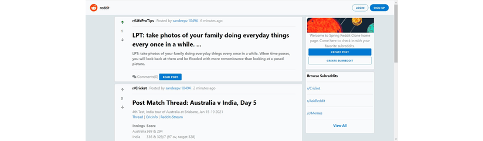
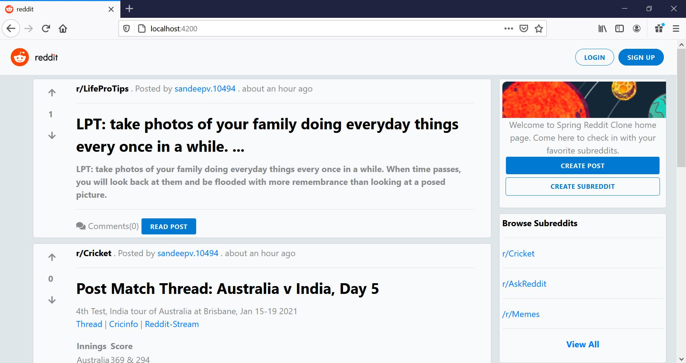

# Reddit Clone App

---
## Info

* Reddit Clone Application using SpringBoot, Java8, Angular 11 and Postgres database. 
* In Reddit Clone Application, Users will be able
    1. Browse posts.
    2. SignUp to the application using Email, UserName, Password and activate the account the using activation mail.
    3. Login to the application.
    4. Create new Posts, Read Posts and create new subreddits.
  
---
## Backend Rest API Details
* Backend Rest APIs are implemented using Spring Boot
* Postgres is used as backend database
* JWT Authentication is implemented for Rest APIs using Spring Security
* Rest API details can be found using Swagger UI Link : http://localhost:8080/swagger-ui.html#/ 
---
## Frontend Details
* Frontend Application is implemented using Angular 11
* Path to front end application code:  
  (src/main/resources/frontend/redditclone-angular-app)
  
### Home Page

### Sign-Up Page

### Login Page

### Post Page

### Create Post Page

### Create Subreddit Page
